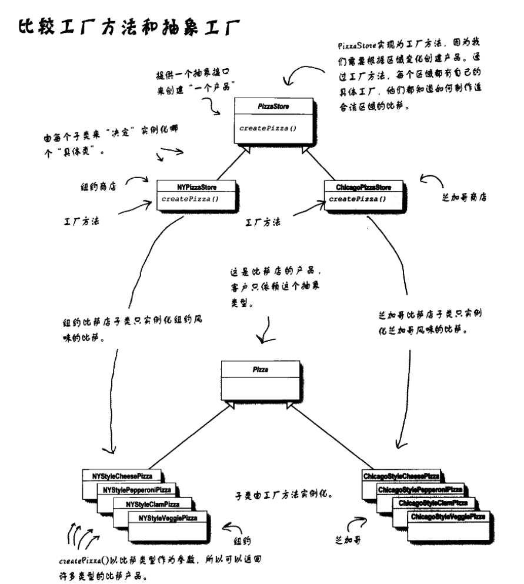
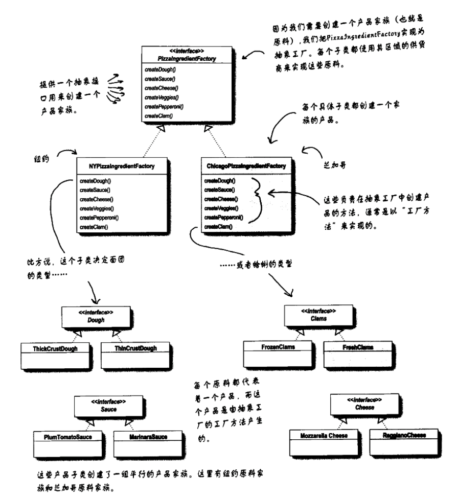

+++
title = "设计模式 —— 抽象工厂模式"
date = "2021-12-12 07:15:30 -0400"
image = "ClassDiagram.png"
author = "isshe"
categories = [ "设计模式" ]
tags = [ "设计模式", "Design Pattern" ]
+++

# 设计模式Readme模板
## 1. 基础概念
* 定义：提供一个创建一系列相关或相互依赖对象的接口，而无需指定他们具体的类。
* 类图：

* 出场嘉宾
    * AbstractFactory: 抽象工厂；声明具体工厂的接口——`声明了`一个创建抽象产品`对象`的接口。
    * ConcreteFactory: 具体工厂；继承自抽象工厂，`实现了`创建具体产品对象的操作。
    * AbstractProduct: 抽象产品；声明具体产品的接口——`声明了`一类产品对象的接口。
    * ConcreteProduct: 具体产品；继承自抽象产品，定义了一个将被具体工厂创建的`产品对象`，`实现了`抽象产品的接口，
    * Client: `仅`使用由抽象工厂和抽象产品类声明的接口——不使用具体工厂、具体产品的接口/方法。

* 工作方式：
    * 运行时创建`具体工厂对象`，具体工厂对象创建`具体产品对象`。
    * 客户使用不同的具体工厂对象，创建不同的具体产品对象。
    * 抽象工厂将产品对象的创建延迟到具体工厂。

## 2. 解决什么问题？如何解决？
* 需联合使用一系列产品的时候，可使用此模式
* 其他见【4.使用场景】

## 3. 优缺点是什么？
### 3.1 优点
* 分离了具体的类：
    * 工厂封装创建产品对象的过程，将客户和类的实现分离。客户通过抽象接口操纵实例。
    * 具体产品的类名也在具体工厂的实现中被分离，它们不会出现在客户代码中。
* 易于交换产品系列：
    * 一个`具体工厂类`在一个应用中仅出现一次——它初始化的时候；
    * 改变`具体工厂类`即可改变产品配置——`具体工厂类A`换为`具体工厂类B`,则产品配置从A也更换到B。
* 有利于产品的一致性：【？？？】
    * 一个系列的`产品对象`被设计成一起工作的时候，一个应用一次只能使用同一个系列中的对象。【？？？】

### 3.2 缺点
* 难以添加新种类的产品，需改代码。（拓展性受到限制）
    * 抽象工厂类确定了可以被创建的产品集合，要新增就要修改此类——它及它的子类都要变化。

## 4. 使用场景是什么？
* 一个系统要独立于它的产品的创建、组合和表示时。【不理解？！】
* 一个系统要由多个产品系列中的一个来配置时。
* 当要强调一系列相关的产品对象的设计以便进行`联合使用`时。
* 当你提供一个产品类库，而只想显示它们的接口而不是实现时。

## 5. 注意/实现
* 将[具体]工厂作为单件：一个应用中一般每个产品系列只需一个具体工厂的实例。
* 抽象工厂只声明接口，不创建产品。创建产品由具体工厂来做。
    * 通常做法：每个产品定义一个工厂方法。[见工厂方法模式](../4.工厂方法模式)
* 定义可扩展的工厂：解决3.2中缺点1
    * 更灵活但不太安全的设计：给创建对象的操作增加一个参数，该参数指定将被创建的对象的种类。【？？？】
        * C++中，只有当产品对象可以被请求它们的客户安全的强制类型转换才能使用。
## 6. 应用实例？
* InterView的`Kit`
* ET++

## w. 待办
* 对定义不理解，理解后，进行备注

## x. 疑问
* 工厂方法模式和抽象工厂模式的区别是什么？
    * 抽象工厂模式通常使用工厂方法模式来实现。
    * 添加一个新的产品，工厂方法修改工厂，抽象工厂新建新工厂。
    * 工厂方法模式:
        * 使用的是`类`;
        * 通过继承创建就对象——拓展一个父类，并覆盖父类的工厂方法【？？？】
        * 用途：把客户代码从实例化的具体类中解耦 或 当不清楚要实例化具体类时使用。
    * 抽象工厂模式
        * 使用的是`对象`。
        * 通过对象的组合创建对象【？？？】
        * 用途：创建产品家族或把集合所制造的相关产品。
    * 《Head First 设计模式》里的比较图
        * 工厂方法模式
        
        * 抽象工厂模式
        
* 5中的`定义可扩展的工厂`不理解？哪里不安全？类型转换？哪里灵活？怎么灵活？

## y. 拓展
* 依赖倒置原则：要依赖抽象，不要依赖具体的类。
    这个原则说明了：不能让高层组件依赖低层组件，而且，不管是高层还是低层组件，都应该依赖抽象。
* 单件模式
* [工厂方法模式](../4.工厂方法模式)
* 如果有多个可能的产品系列，具体工厂也可以使用原型模式来实现。

## z. 参考
* 《Head First设计模式》p144页开始

