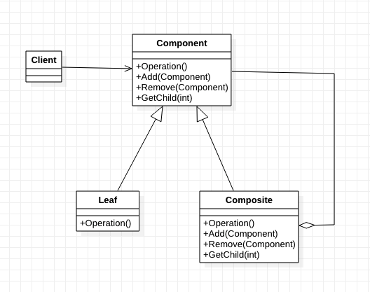
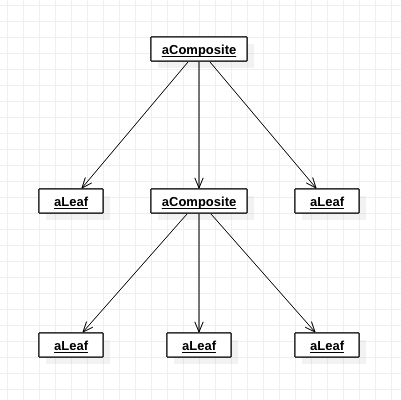

+++
title = "设计模式 —— 组合模式"
date = "2021-12-12 07:15:30 -0400"
image = "ObjectDiagram.png"
author = "isshe"
categories = [ "设计模式" ]
tags = [ "设计模式", "Design Pattern" ]
+++

# 组合模式
* 目标：
    * 初接触此模式时，熟悉最常用的使用方式。
    * 有更深的理解后，再研究其他使用方法。
## 1. 基础概念
* 定义/意图：将对象组合成树形结构以表示`部分-整体`的层次结构。组合模式使得用户对单个对象和组合对象的使用具有一致性。
* 别名：Composite
* 类图1：

* 类图2：

* 典型对象图：

* 出场嘉宾
    * Component: 组合
        * 为组合中的对象声明接口。
        * 在适当情况下，实现公共接口的缺省行为。
        * 声明一个接口用于`访问`和`管理`Component组件。
    * Leaf: 叶节点，叶子部件
        * 在组合中表示叶节点对象，叶节点没有子节点。
        * 定义节点对象的具体的行为。
    * Composite: 组合部件，有孩子的部件。
        * 定义有孩子节点的节点的行为。
        * 存储孩子节点。
        * 在Component接口中实现与子节点有关的操作。
    * Client：
        * 通过Component接口操纵组合部件的对象。
* 协作/工作流程
    * Client使用Component接口与组合结构中的对象(Composite/Leaf)进行交互。
    * 如果接收者是叶节点，则直接处理请求。
    * 如果接收者是Composite，通常转发请求给它的子部件，在转发之前或之后，可能执行一些辅助操作。

## 2. 优缺点是什么？
### 2.1 优点
* 定义包含`基本对象`和`组合对象`的类层次结构。
    * 基本对象可以被组合成更复杂的组合对象
    * 组合对象可以被再组合。
* 简化客户代码。
    * 客户可以统一地使用`基本对象`和`组合对象`。
* 更容易增加新类型的组件。

### 2.2 缺点
* 使得设计变得更一般化。
    * 更容易增加新组件的同时，也使得限制组合中的组件变得困难。
    * 有时可能会希望一个组合只能有某些特定的组件。使用Composite时，不能依赖类型系统施加这些约束。

## 3. 使用场景是什么？
* 想表示对象的`部分-整体`层次结构。
* 希望用户忽略组合对象与单个对象的不同。统一地使用组合结构中的所有对象。

## 4. 注意
* 实现组合模式需要考虑的问题：
    * 显式的父组件引用。
        * `保持子组件都父组件的引用`能简化组合结构的遍历和管理。
        * 通常在Component类中定义父组件引用。
    * 共享组件。
        * 可以减少对存储的需求。
        * 当一个组件只有一个父组件时，很难共享组件。【？？？】
    * 最大化Component接口。
        * 组合模式的目的之一是：使得用户不知道他们正在使用的是Leaf还是Composite。
    * 声明管理子组件的操作。
        * 是在Component中进行声明，并使得对Leaf也有意义呢？还是只在Composite中声明？
            * 需要在`安全性`和`透明性`之间做出权衡：
                * 在Component中声明，会具有更好的透明性——Leaf和Composite有一致的接口。
                * 在Composite中声明，会具有更好的安全性——在类似C++静态类型语言中，任何对Leaf的不必要操作(Remove/Add)，都能在编译时被发现。
    * Component是否应该事先一个Component列表？
        * 有时候可能想要在Component类中将子节点定义为一个实例变量，方便访问和管理这些子节点。但对于叶节点，会造成空间浪费。
    * 子组件排序。
    * 使用高速缓冲存储改善性能。
        * Composite可以缓冲存储实际结果。
    * 应该由谁来删除Component。
        * 当一个Composite被销毁时，通常由此Composite负责删除其子节点。
    * 存储组件最好用哪一种数据结构？
        * 存储子节点可以用：链表，数组、树、Hash表。选取取决于效率。

## 5. 应用实例？
* 

## w. 待办
* 

## x. 疑问
* 

## y. 拓展
* 相关模式：
    * 装饰者模式(Decorator)：常和组合模式一起使用。当装饰和组合一起使用时，它们通常由一个公共的父类。
    * Flyweight: 让你共享组件，但不能再引用它们的父组件。
    * 迭代器模式(Iterator): 可以用来遍历Composite。
    * 访问者模式(Visitor): 将本来应该分布在Composite和Leaf类中的操作和行为局部化。【？？？】

## z. 参考
* 《设计模式：可复用面向对象软件的基础》
* 《Head First设计模式》

