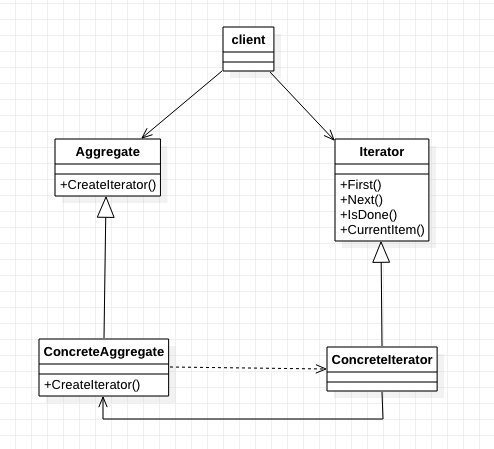

+++
title = "设计模式 —— 迭代器模式"
date = "2022-10-16 12:23:30 -0300"
image = "ClassDiagram.png"
author = "isshe"
categories = [ "设计模式" ]
tags = [ "设计模式", "Design Pattern" ]
+++

# 迭代器模式——提供不暴露聚合对象内部表示的访问聚合对象各个元素的方法
* 目标：
    * 初接触此模式时，熟悉最常用的使用方式。
    * 有更深的理解后，再研究其他使用方法。
## 1. 基础概念
* 定义/意图：提供一种方法`顺序`访问一个`聚合对象`中各个元素，而又不需暴露改对象的内部表示。
* 别名：游标（Cursor）
* 分类：对象行为型模式
* 类图：

* 出场嘉宾
    * Iterator: 迭代器
        * `定义`访问和遍历元素的接口。
    * ConcreteIterator: 具体迭代器
        * `实现`对具体聚合对象的迭代器接口。
        * 对聚合对象遍历时，跟踪当前位置。
    * Aggregate：聚合
        * `定义`创建相应迭代器对象的接口。
    * ConcreteAggregate：具体聚合
        * `实现`创建相应迭代器的接口
        * 返回ConcreteIterator的一个适当实例。
* 协作/工作流程
    * 通过 ConcreteAggregate 创建 ConcreteIterator；
    * 通过 ConcreteIterator 访问/遍历 ConcreteAggregate。

## 2. 优缺点是什么？
### 2.1 优点
* 支持以不同的方式遍历一个聚合。
    * 复杂的聚合可用多种方式进行遍历。
* 迭代器简化了聚合的接口。
    * 用了迭代器的遍历接口，聚合就不需要提供遍历接口，于是就简化了聚合的接口。
* 同一个聚合上可以有多个聚合。
    * 每个迭代器保持自己的遍历状态，因此可以同时进行多个遍历。

### 2.2 缺点
* 

## 3. 使用场景是什么？
* 需要操作聚合对象的时候。

## 4. 注意
* 实现需要注意的问题：
    * 谁控制该迭代？迭代器还是客户？
        * 由客户控制迭代时，该迭代器称为外部迭代器。客户主动推动遍历的步伐，显式向迭代器请求下一个元素。
        * 由迭代器控制迭代时，该迭代器称为内部迭代器。客户提交一个待执行操作，迭代器对聚合的内阁元素都实施该操作。
        * 外部迭代器比内部迭代器更灵活。
    * 谁定义遍历算法？
        * 迭代器不是唯一可定义遍历算法的地方。
        * 聚合本身也可以定义遍历算法，并在遍历过程中用迭代器来存储当前迭代的状态。这种迭代器被称为`游标(cursor)`, 因为它仅用来指示当前位置。
    * 迭代器健壮程度如何？
        * 遍历一个聚合时更改这个聚合是危险的。
        * **一个健壮的迭代器保证插入和删除操作不会干扰遍历，且不需要拷贝该聚合**。
    * 附加的迭代器操作。
        * 最小接口：First、Next、IsDone、CurrentItem
        * 附加操作：SkipTo、Previous等
    * 在C++中使用多态的迭代器。
        * 代价：要求用一个`工厂方法`动态地分配迭代器对象。
        * **仅当必须多态时，才使用！**
        * 另一个缺点：客户必须负责删除它们。（这里常常出现bug）
    * 迭代器的特权访问。
        * 迭代器可被看为聚合的一个扩展，迭代器和聚合紧密耦合。
    * 用于复合对象的迭代器。【？？？】
    * 空迭代器——退化的迭代器。
        * 有助于处理边界条件。
        * 常用于遍历树形结构的聚合。

## w. 待办
* 

## x. 疑问
* 

## y. 拓展
* 相关模式
    * Composite: 组成模式
    * Factory Method: 工厂方法模式
    * Memento：备忘录模式

## z. 参考
* 《设计模式：可复用面向对象软件的基础》
* 《Head First设计模式》

