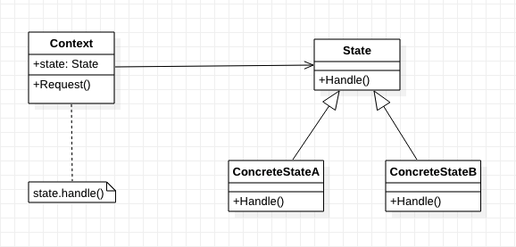

+++
title = "设计模式 —— 状态模式"
date = "2022-10-16 12:00:00 +0800"
image = "ClassDiagram.png"
author = "isshe"
categories = [ "设计模式" ]
tags = [ "设计模式", "Design Pattern" ]
+++

# 状态 (State) 模式
* 目标：
    * 初接触此模式时，熟悉最常用的使用方式。
    * 有更深的理解后，再研究其他使用方法。
## 1. 基础概念
* 定义/意图：允许一个对象再起内部状态改变时改变它的行为。对象看起来似乎修改了它的类。
* 别名：状态对象 (Objects for States)
* 类图：

* 出场嘉宾
    * Context: 上下文、环境
        * 定义客户感兴趣的接口。
        * 维护一个 ConcreteState 子类的实例，表示当前状态。
    * State：状态，抽象类/接口
        * 定义一个接口，以封装与 Context 的特定状态相关的行为。
    * ConcreteState：具体状态
        * 定义一个具体的状态，实现一个与 Context 的一个状态的相关的行为。
* 协作/工作流程
    * Context 保存一个 ConcreteState 对象，表示当前状态。
    * Context 将与状态相关的请求委托给当前的 ConcreteState 对象处理。
    * Context 可将自身作为一个参数传递给处理请求的状态对象。
    * Context 是客户使用的主要接口。
    * Context 和 ConcreteState 都可以决定哪一个状态是后继状态。

## 2. 优缺点是什么？
### 2.1 优点
* 状态模式将特定状态相关的行为局部化，并且将不同状态的行为分割开。
* 状态模式使得状态转换显式化。【？？？】
    * 为不同的状态引入独立的对象使得转换变得更加明确。
* 状态对象可被共享：可被多个 Context 共享。

### 2.2 缺点
* 增加了对象的数目。
* C++ 里面容易导致头文件循环引用。解决方法，见 C++ 示例的 TCPState.h 文件

## 3. 使用场景是什么？
* 一个对象的行为取决于它的状态，并且他必须在运行时刻根据状态改变它的行为。
* 一个操作中含有庞大/多分支的条件语句，且这些分支依赖于该对象的状态。
    * 状态模式将每一个条件分支放入一个独立的类中。

## 4. 注意
* 实现时需要考虑的问题：
    * 谁定义状态转换：Context 还是 ConcreteState？
        * Context 可以实现，但是用 ConcreteState 通常更灵活更合适。（需要 Context 增加接口，供 ConcreteState 改变状态）
    * 基于表的另一种方法。
        * 详见四人帮《设计模式》204 页。
    * 创建和销毁 ConcreteState 对象。
        * 提前创建，不销毁。
            * 状态改变频繁，则考虑此方法。
        * 需要时创建，不需要时销毁。
            * 当将要进入的状态在运行时是不可知的，并且上下文不经常改变状态，则考虑此方法。
            * 当 ConcreteState 对象存储大量信息，且不常改变状态，考虑此方法。
    * 使用动态继承。【？？？】

## 5. 应用实例？
* 

## w. 待办
* 

## x. 疑问
* 转换显式化，如何才算显式化？
* 什么是动态继承？

## y. 拓展
* 相关模式：
    * Singleton：单例模式，状态对象通常是单例模式。
    * Flyweight：享元模式。解释何时、怎样共享状态对象。

## z. 参考
* 《设计模式：可复用面向对象软件的基础》
* 《Head First 设计模式》

