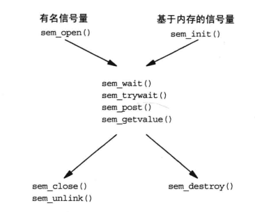

+++
title = "操作系统 —— 进程间通信之 Posix 信号量"
categories = [ "进程间通信", "操作系统" ]
tags = [ "posix", "信号量", "进程间通信", "操作系统", "application", "linux" ]
date = "2022-10-16 12:00:00 +0800"
image = "posix_semabphore_functions.png"
author = "isshe"
+++


# Posix 信号量
信号量是一种提供不同进程间或一个进程的不同线程间同步手段的原语。
Posix 提供两类信号量：
* 有名 (named) 信号量
* 基于内存 (memory-base) 的信号量。【macOS 不支持】

* Posix 有名信号量至少具有岁内核的持续性。
* Posix 信号量是计数信号量。

## 1.相关函数
```c
#include <fcntl.h>           /* For O_* constants */
#include <sys/stat.h>        /* For mode constants */
#include <semaphore.h>

// 打开
sem_t *sem_open(const char *name, int oflag);
sem_t *sem_open(const char *name, int oflag,
               mode_t mode, unsigned int value);

// 关闭
int sem_close(sem_t *sem);

// 删除
int sem_unlink(const char *name);

// "加锁"——测试指定信号量的值，如果大于 0，将它 -1
int sem_wait(sem_t *sem);
int sem_trywait(sem_t *sem);
int sem_timedwait(sem_t *sem, const struct timespec *abs_timeout);

// “解锁”——信号量 +1
int sem_post(sem_t *sem);

// 获取信号量的值 (macOS 不支持)
int sem_getvalue(sem_t *sem, int *sval);

// 基于内存的信号量 (macOS 不支持)
int sem_init(sem_t *sem, int shared, unsigned int value);
int sem_destroy(sem_t *sem);
```

## A.拓展
* 信号量、互斥锁、条件变量之间的差异：
    * 互斥锁必须由给它上锁的线程解锁；信号量的挂出 (解锁) 却不必在同一线程执行。
    * 互斥锁要么被锁住，要么被解开。（二值状态）
    * 信号量有一个与之关联的状态（计数值），信号量的挂出操作总是被记住。【？】
* macOS 不支持基于内存的信号量。
* 使用 FIFO 实现 Posix 信号量
    * 打开读 fd 和写 fd；
    * sem_wait() 读出一个字节；没有字节可读，就阻塞；
    * sem_post() 写入一个字节；
    * 这个实现应该不能用于进程间。（除非共享内存？）