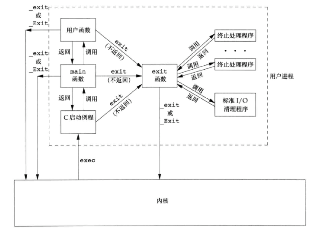
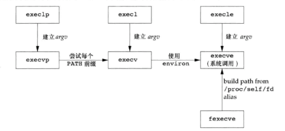

+++
title = "操作系统 —— 进程"
image = "process_address_map.png"
tags = [ "process", "操作系统", "application", "linux" ]
date = "2021-12-13 02:51:23 -0400"
author = "isshe"
categories = [ "操作系统" ]
+++


# 进程
进程是操作系统中最核心的概念。
* 定义：一个执行中的程序的实例。（对正在运行程序的一个抽象）
* 是资源分配的基本单位。
* 进程提供给应用程序的关键抽象：
  * 一个独立的`逻辑控制流`，它提供一个假象，好像程序独占地使用处理器。
  * 一个私有的`地址空间`，它提供一个假象，好像程序独占地使用存储器系统。
* `逻辑流(逻辑控制流）`：程序计数器PC值的序列。
  * 异常处理程序、进程、信号处理程序、线程和Java进程都是逻辑流的例子。
* `并发流(concurrent flow)`：一个逻辑流的执行在时间上与另一个流重叠。
* `并发`：多条流并发地执行的一般现象称为并发(concurrecy)。
* `多任务(multitasking)`：一个进程和其他进程轮流运行的概念称为多任务。
* `时间片(time slice)`：一个进程执行它的控制流的一部分的每一时间段。
* `并行流(parallel flow)`：两个流运行在不同的处理器上或者不同的计算机上。
* `上下文(context)`：内核重新启动一个被抢占的进程所需要的状态。
* `上下文切换`：内核为每个进程维护一个`上下文(context)`，多任务的实现依赖上下文切换。
  * 1）保存当前进程的上下文；
  * 2）恢复某个先前被抢占的进程被保存的上下文；
  * 3）将控制传递给这个新恢复的进程；

## 1.进程地址空间
### 1.1 典型进程地址空间1

* 代码段起始地址：
  * 32位：0x08048000
  * 64位：0x00400000
* 进程从用户模式变为内核模式的方法是：中断、故障、陷入系统调用。

### 1.2 典型进程地址空间2


## 2. 进程状态 
### 2.1 状态转换图
* 


### 2.2 基本状态
* 1）运行态：进程实际占用CPU；
* 2）就绪态：可运行；
* 3）阻塞态：除非某种外部事件发生(使进程满足运行条件)，否则进程不能运行。

### 2.3 引入的状态：
* 创建状态；
* 终止状态；
* 挂起状态；（图中没有）


## 3. 进程控制
### 3.1 进程创建与终止
* 导致`进程创建`的主要事件：
    * 1）系统初始化；
    * 2）正在运行的程序执行了创建进程的系统调用；
    * 3）用户请求创建一个新进程；
    * 4）一个批处理作业的初始化；
* 导致`进程终止`的主要事件：
    * 1）正常退出（自愿的）
      * A.从main返回；
      * B.调用exit；
      * C.调用_exit或_Exit;
      * D.最后一个线程从其启动例程返回；
      * E.从最后一个线程调用pthread_exit()；
    * 2）出错退出（自愿的）
      * 调用abort
    * 3）严重错误/被其他进程杀死（非自愿）
      * 接到终止信号；
      * 最后一个线程对取消(cancellation)请求做出响应；
* 相关函数
```c
#include <stdlib.h>
#include <unistd.h>

// 进程创建
pid_t fork(void);
// 进程退出
// 进行一些清理（关闭文件描述符之类的）,然后返回内核
void exit(int status);
// 下面两个直接返回内核
void _Exit(int status);
void _exit(int status);
```
* fork失败的主要原因：
    * 系统中已经有太多进程。
    * 该实际用户ID的进程数超过了系统限制。

## 4. 守护进程
* 守护进程：
    * 一种生存期长的进程。
    * 后台运行；
    * 没有控制终端；
### 4.1 编程规则
* 1）调用umask将文件模式创建屏蔽字设置为一个已知的值（通常是0）；【疑问？！】
* 2）调用fork，然后使父进程exit；
* 3）调用setsid创建一个新会话；
    * a）进程成为新会话的首进程；
    * b）成为一个新进程组的组长进程；
    * c）没有控制终端；
* 4）将当前工作目录更改为根目录；
* 5）关闭不再需要的文件描述符；
* 6）[选]打开/dev/null使进程具有文件描述符0/1/2。
    * 使所有读标准输入，写标准输出/错误输出的库例程都不会产生效果。
### 4.2 示例
* 见[守护进程示例](Examples/1_daemonize.c)

### 4.3 守护进程的惯例
* 锁文件放`/var/run`目录，命名为`name.pid`。
* 配置放`/etc`目录，命名为`name.conf`。
* 可用命令行启动。
    * 通常由`/etc/rc*`或`/etc/init.d/*`启动。
    * 守护进程终止时，应当自动重启。(`/etc/inittab`中为守护进程添加`respawn`记录项【macOS没有此文件！】)
* 守护进程可通过SIGHUP信号，重新读取配置（当配置更新时）。

## 5. 进程实现
* 进程表：操作系统维护的一张表格——一个结构数组。
* 进程表项：也称`进程控制块`，是`进程表`的表项。
* 典型系统中的一些关键字段：

|进程管理|存储管理|文件管理|
|---|---|---|
|寄存器|正文段指针|根目录|
|程序计数器|数据段指针|工作目录|
|程序状态字|堆栈段指针|文件描述符|
|堆栈指针||用户ID|
|进程状态||组ID|
|优先级|||
|调度参数|||
|进程ID|||
|父进程|||
|进程组|||
|信号|||
|...|||


## A.拓展
### A.1 进程组
* 进程组：在类UNIX系统中，进程和它的所有子进程以及后裔进程共同组成一个进程组。
* 进程组相关函数:
```
#include <unistd.h>

// 获取进程组ID
pid_t getpgrp(void);
// 改变自己或其他进程的进程组
// pid == 0: 使用当前进程
// pgid== 0: pid进程的PID作为进程组ID。
int setpgid(pid_t pid, pid_t pgid);
```
* 僵死进程/僵尸进程：终止，但未被回收的进程。
  * 进程已经终止了，但内核仍保留它的某些状态直到父进程回收它为止。
* 相关函数:
```c
#include <stdlib.h>
#include <sys/types.h>
#include <unistd.h>
#include <sys/wait.h>

pid_t waitpid(pid_t pid, int *status, int options);
pid_t wait(int *status);
unsigned int sleep(unsigned int secs);
int pause(void);
```
### A.2 子进程回收方式
* 回收子进程的方式：用SIGCHLD信号。子进程终止时，会发送SIGCHLD信号给其父进程。
【详见[ex_SIGCHLD.c](../2.信号/Examples/2_ex_SIGCHLD.c)】

### A.3 C程序的启动和终止

* **内核使程序执行的唯一方法：exec!**

### A.4 进程资源限制
* 见《Unix环境高级编程》p175

### A.5 7个exec的关系


### A.6 ps命令中进程状态
* `R`: TASK_RUNNING，可执行状态。
* `S`: TASK_INTERRUPTIBLE，可中断的睡眠状态。
* `D`: TASK_UNINTERRUPTIBLE，不可中断的睡眠状态。
* `T`: TASK_STOPPED/TASK_TRACED，暂停状态或跟踪状态。
* `Z`: TASK_DEAD – EXIT_ZOMBIE，退出状态，进程成为僵尸进程。
* `X`: TASK_DEAD – EXIT_DEAD，退出状态，进程即将被销毁。

## B.疑问/不懂
* 孤儿进程组?
* 文件模式创建屏蔽字是什么？有何作用？(umask()设置的那个))

## C.参考
* https://blog.csdn.net/i_scream_/article/details/51569355
* 《Unix环境高级编程》
* 《现代操作系统》
* 《深入理解计算机系统》